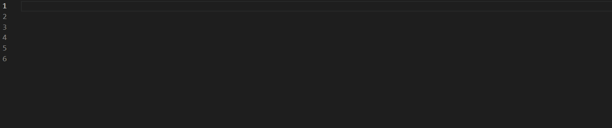
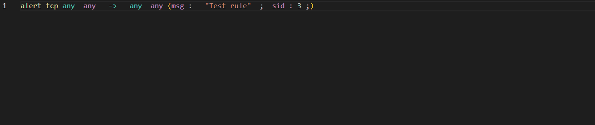
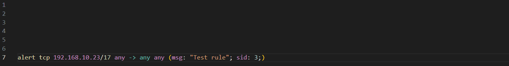
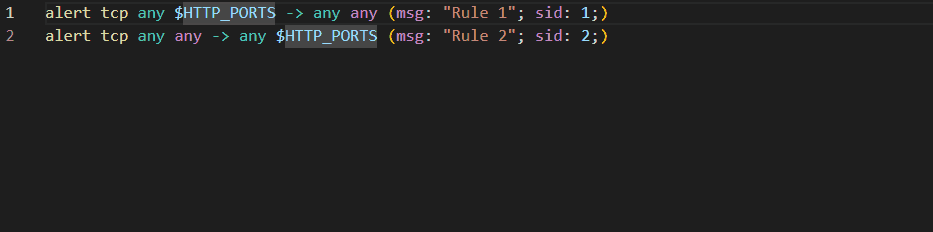
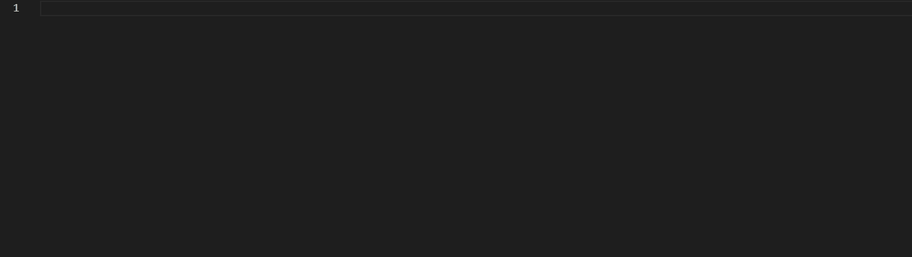
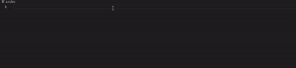
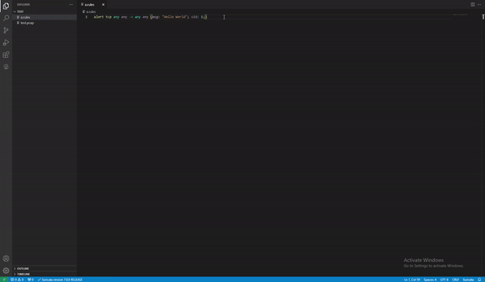

# Meerkat

Suricata/Snort formatter extension for VS Code

## Features
Meerkat provides the following features:
- Syntax highlighting
### Signature checking with suricata


### Signature formatting

*The Auto-formatting uses the default hotkeys in your code editor*

### Hover information


### Variable references/renaiming

*The rename feature uses the default hotkeys in your code editor*

### Code completion


### Code snipplets


### PCAP Testing


**Warning:** pcap visualization only works if additional third party extenssions are installed. Please install one of the available extenssions to be able to open pcap files in VS Code.

- Rule linting (TOOD)
- Rule performance statistics (TODO)

## Structure
Meerkat consists of three parts:
- Parser: powered by chumsky, the signature parser promises high-speed and high-reliability signature parser.
- Server logic: once a rule is parsed, it is analyzed to provide useful debugging and linting information to the user.
- Language server: the tower framework is used to create a language server, which can be used by any text editor, which [supports the LSP](https://microsoft.github.io/language-server-protocol/implementors/tools/).

## How to install it

### Linux/Mac
Install cargo, if you have not done already:
```bash
npm run install-rust
```
*You will be propted to accept the default configuration*

Install all dependencies for the project:
```bash
npm install
```

Package the extenssion:
```bash
npx vsce package
```
*The script will also install the meerkat language server for you*

At the end you should have a file named meerkat.vsix, which can be opened by VSCode

### Windows
**Make sure you have rust installed!**

Install all dependencies for the project:
```bash
npm install
```
Package the extenssion:
```bash
npx vsce package
```
*The script will also install the meerkat language server for you*

At the end you should have a file named meerkat.vsix, which can be opened by VSCode

## Updating
Following the installation steps and opening the .vsix file with VSCode should be enough to update the extenssion.

## Suricata signatures

### Docs
The [suricata documentation](https://suricata.readthedocs.io/en/suricata-6.0.0/rules/intro.html#rule-options) was used for a deeper understanding of the sturcture and function of suricata rules

### Grammar
The following grammar was used to implement a praser for the rules:
```
<Rule> ::= <action> " " <header> " " "(" <options> ")"
<action> ::= "alert" | "pass" | "drop" | "reject" | "rejectsrc" | "rejectdst" | "rejectboth"
<header> ::= <protocol> " " <IPAddress> " " <port> " " <direction> " " <IPAddress> " " <port>

<protocol> ::= [a-z]+

/* Handling IP Addresses */
<IPAddress> ::= <IPRange> | <NegatedIP> | <IPGroup> | <variable> | "any"

<IPGroup> ::= "[" <IPAddress> ("," <IPAddress>)* "]"
/* any number containing 1 to 3 digits */
<IPQuart> ::= ([0-9] [0-9]? [0-9]?)
/* any 4 numbers separated by dots*/
<IP> ::= <IPQuart> "." <IPQuart> "." <IPQuart> "." <IPQuart>
/* CIDR */
<IPRange> ::= <IP> "\\" ([0-9] [0-9]?) 
<NegatedIP> ::= "!" (<IP> | <IPRange> | <IPGroup> | <variable>)
<variable> ::= "$" ([a-z] [A-Z] "-" "_")+

/* Handling ports */
<port> ::= <portNumber> | <portGroup> | "any"

<portNumber> ::= ([0-9] [0-9]? [0-9]? [0-9]? [0-9]?)
<portRange> ::= <portNumber> ":" <portNumber>?
<negatedPort> ::= "!" (<portNumber> | <portRange> | <portGroup>)
<portGroup> ::= "[" <port> ("," <port>)* "]"

/* Directions */
<direction> ::= "->" | "<>" | "<-"


<options> ::= <option>+
<option> ::= <keyword> ":" <settings> ";" | <keyword> ";"
<keyword> ::= ([a-z] [A-Z] "_" "-")+
<settings> ::= ([a-z] [A-Z] "_" "-")+ | (<settings> ("," <settings>)+)
```

## I want to contribute
You can easily contribute by reporting issues to the Git page of the project

If you want to contribute by writing code, the rust docs for the project is a perfect location to start at, just run:
```bash
cargo doc --open
```


## Installation troubleshooting
### Unexpected token '?'
If you get the following error:
```
SyntaxError: Unexpected token '?'
    at wrapSafe (internal/modules/cjs/loader.js:915:16)
    at Module._compile (internal/modules/cjs/loader.js:963:27)
```
The issue is most probably the version of the Node that you're using.


### Linker 'cc' not found
If you get the following error:
```
error: linker `cc` not found
  |
  = note: No such file or directory (os error 2)

error: could not compile `quote` due to previous error
```
Try the following solution:
```
sudo apt install build-essential
```

### Vulnerabilities, while installing with npm
The issue is most probably related to the version of npm used. Try updating npm:
```
npm update
```
This command should tell you if you have an older version of npm and give you the line you need to run to update it
